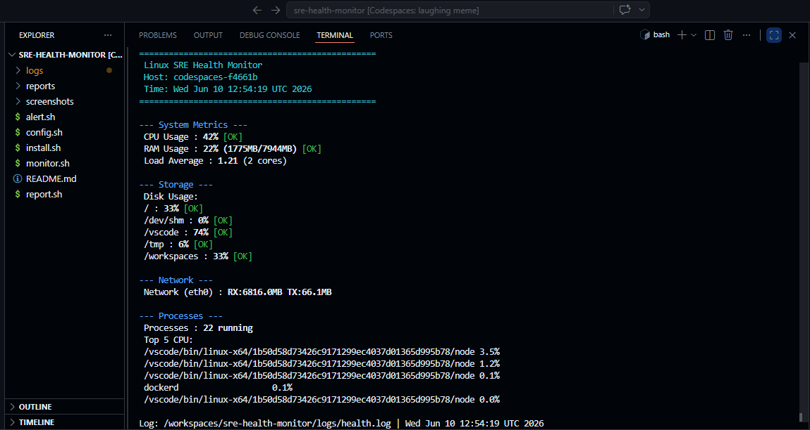
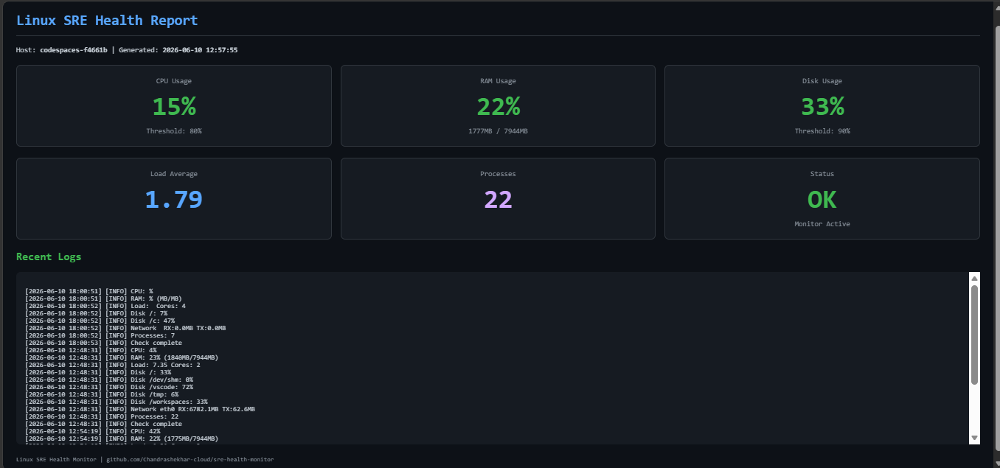
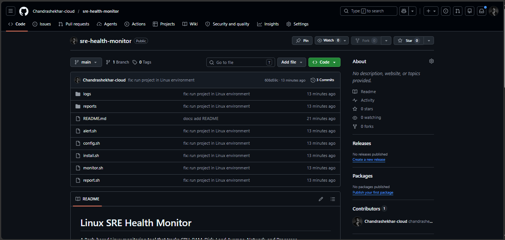

# 🚀 Linux SRE Health Monitor


A production-style Linux monitoring solution built with **Bash**, **Cron**, **Linux utilities**, **Slack Webhooks**, and **HTML reporting**.

The project continuously monitors system health, generates daily reports, logs metrics, and sends alerts when configured thresholds are breached.

---

# 📌 Features

✅ CPU Monitoring

✅ RAM Monitoring

✅ Disk Usage Monitoring

✅ Load Average Monitoring

✅ Network Statistics

✅ Process Monitoring

✅ Slack Alert Integration

✅ HTML Dashboard Reports

✅ Automated Logging

✅ Cron-based Scheduling

---

# 🏗️ Architecture

```text
+-------------------+
|     Cron Jobs     |
+---------+---------+
          |
          v
+-------------------+
|   monitor.sh      |
+---------+---------+
          |
          +-------------------+
          |                   |
          v                   v
+----------------+   +----------------+
| health.log     |   | Slack Alerts   |
+----------------+   +----------------+
          |
          v
+-------------------+
|   report.sh       |
+---------+---------+
          |
          v
+-------------------+
| HTML Dashboard    |
+-------------------+
```

---

# 📂 Project Structure

```text
sre-health-monitor/
│
├── config.sh
├── monitor.sh
├── alert.sh
├── report.sh
├── install.sh
│
├── logs/
│   └── health.log
│
├── reports/
│   └── report_YYYY-MM-DD.html
│
├── screenshots/
│   ├── monitor-output.png
│   ├── html-report.png
│   └── github-repo.png
│
└── README.md
```

---

# 📸 Screenshots

## Terminal Monitoring Dashboard



---

## HTML Health Report



---

## GitHub Repository



---

# ⚙️ Technologies Used

| Technology     | Purpose                |
| -------------- | ---------------------- |
| Bash           | Automation             |
| Linux          | Monitoring Environment |
| Cron           | Scheduling             |
| Slack Webhooks | Alerting               |
| HTML/CSS       | Reporting              |
| Git & GitHub   | Version Control        |

---

# 🚦 Monitored Metrics

| Metric        | Threshold      |
| ------------- | -------------- |
| CPU Usage     | 80%            |
| RAM Usage     | 85%            |
| Disk Usage    | 90%            |
| Load Average  | CPU Core Count |
| Network RX/TX | Logged         |
| Process Count | Logged         |

---

# 🖥️ Running the Project

```bash
git clone https://github.com/Chandrashekhar-cloud/sre-health-monitor.git

cd sre-health-monitor

chmod +x *.sh

./monitor.sh

./report.sh
```

---

# 📊 Sample Output================================================
 Linux SRE Health Monitor
 Host: codespaces-f4661b
================================================

--- System Metrics ---
CPU Usage : 42% [OK]
RAM Usage : 22% (1775MB/7944MB) [OK]
Load Average : 1.21 (2 cores)

--- Storage ---
/ : 33% [OK]

--- Network ---
Network (eth0) : RX:6816.0MB TX:66.1MB

--- Processes ---
Processes : 22 running
---
# 🎯 Resume Highlights

* Built an automated Linux health monitoring system using Bash scripting.
* Implemented real-time system metric collection and threshold-based alerting.
* Developed HTML dashboards for system health visualization.
* Integrated Slack notifications for operational alerting.
* Designed production-style logging and monitoring workflows.

---

# 👨‍💻 Author

**Chandrashekhar H S**

GitHub: https://github.com/Chandrashekhar-cloud

---

⭐ If you found this project useful, consider giving it a star.
